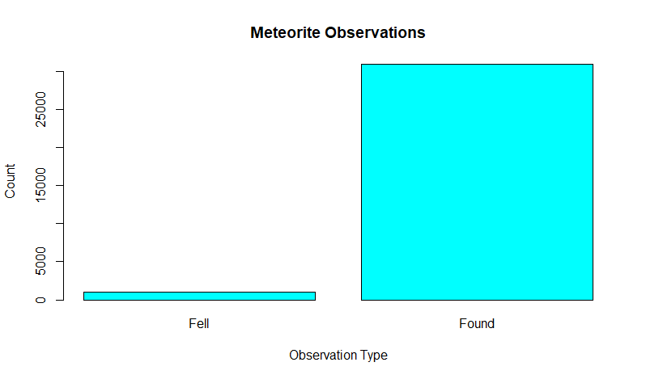
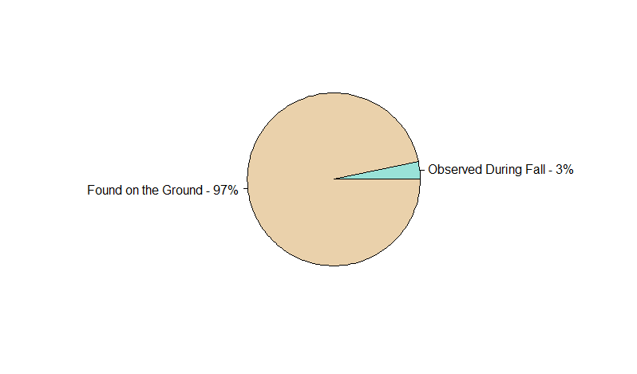
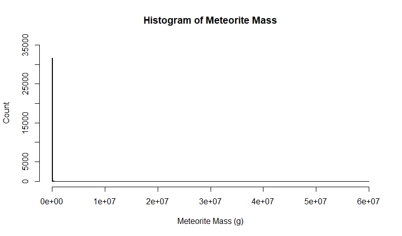
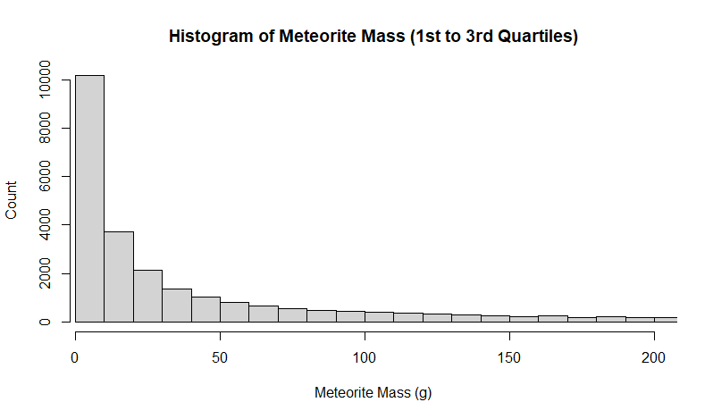
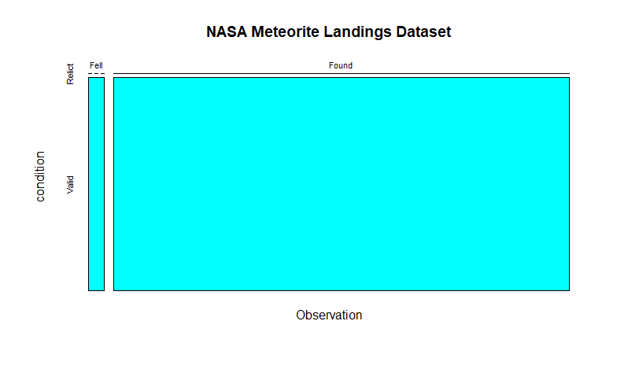
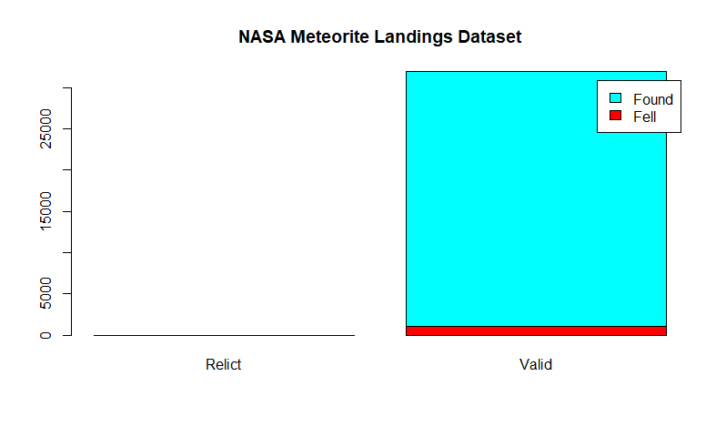
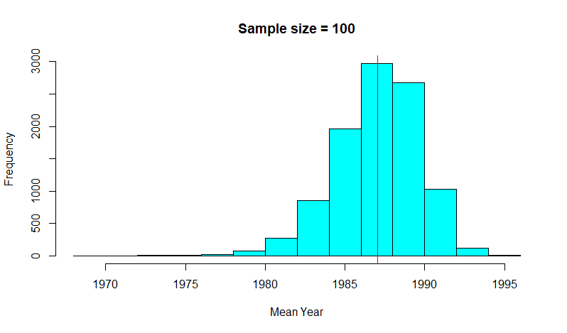
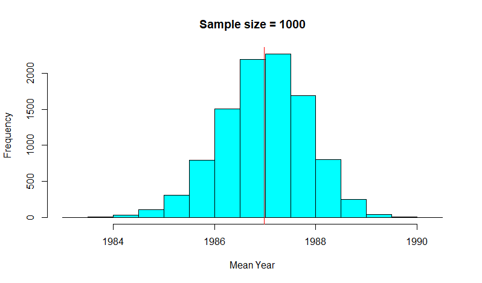
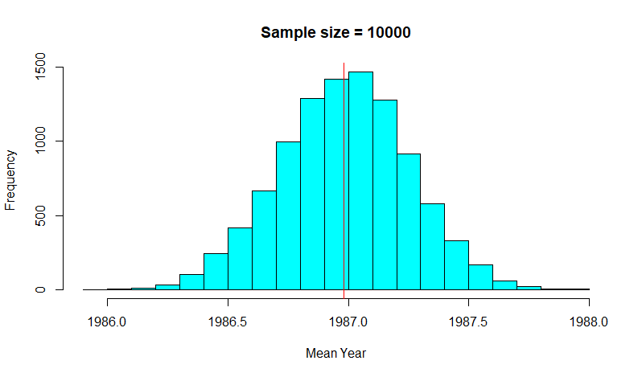
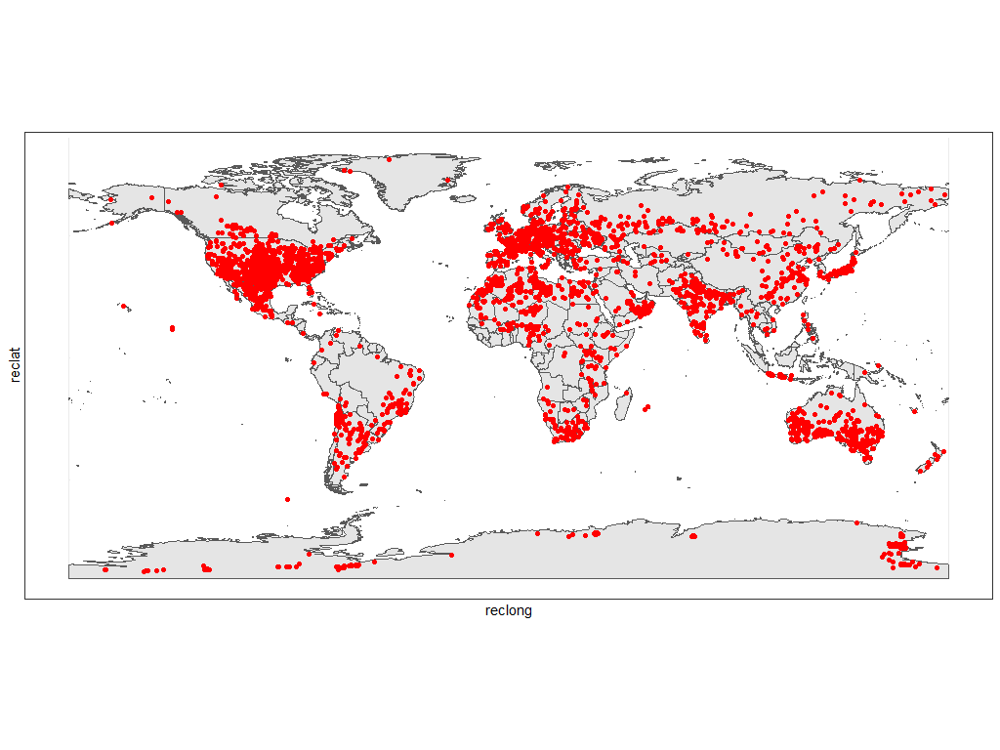

# Exploratory Analysis of NASA Meteorites Dataset

#### <u>Dataset source:</u>

This dataset can be downloaded from the NASA website (https://data.nasa.gov/Space-Science/Meteorite-Landings/gh4g-9sfh) or Kaggle (https://www.kaggle.com/nasa/meteorite-landings).

This dataset includes information on meteorite name, unique id, class, mass, whether it was observed during fall, year it fell or was found as well as its location. 

In total, NASA Meteorite Landings Dataset includes 45,716 observations before data cleaning.


#### <u>Preparing the data:</u>

Based on the NASA notes on the dataset, all observations where the year is before 860 CE or after 2016 need to be filtered out. Additionally, latitude and longitude data 0N/0E needs to be filtered out as their system defaulted meteorites observed in Antarctica to that location and there is no reliable way of checking. 


#### <u>Categorical Variable Analysis:</u>

Variable *fall* describes whether or not the meteorite was observed during fall. This is a great example of nominal categorical data. For non-visual representation this univariate dataset can be summarized in a table:

```
> table(meteorite.landings$fall)

 Fell Found 

 1064 30847
```

Only approximately 1/31 meteorites that fell to Earth was observed during the fall. For better visual representations please refer to the graphs below:



A pie chart may be a better representation of how few meteorites get observed in the sky before falling down. 




#### <u>Numerical Variable Analysis:</u>

*Mass* variable contains information about meteorite’s mass and is a great example of numerical ratio data. This variable has been cleaned-up earlier to make sure there were no empty data points. Unit of measurement for mass in this dataset is a gram. 

Mean mass among meteorites that have landed on Earth is 18542.89g.

Median mass is significantly lower at 29.6 grams.

Meteorite mass data are bimodal as both 1.3 grams and128 grams occur equally the greatest number of times. 

Minimum and maximum masses are 9 orders of magnitude apart from each other with the smallest meteorite weighing 0.01 gram and the heaviest weighing 60,000,000 grams. 

Meteorite mass data has an incredibly high variance of 472,028,165,887 and a standard deviation of 687,043.1.

First quartile is 6 grams, 3rd quartile is 202 grams.

Interquartile range is 195.6.

Visualizing this dataset is very difficult due to how far right skewed this dataset is.



Zooming in between the first and third quartiles provides a slightly better visual.




#### <u>Bivariate Data Analysis:</u>

Bivariate data analysis will feature two categorical variables in NASA Meteorite Landings dataset: fall observation and nametype. While fall observation was covered in the Categorical Variable Analysis section, nametype needs a few words. Nametype variable describes if the meteorite is typical or if is a relict, highly degraded by the weather on Earth.

```
           condition
Observation Relict Valid
      Fell       0  1064
      Found      3 30844	
```

Adding marginal distributions yields:

```
           condition
Observation Relict Valid   Sum
      Fell       0  1064  1064
      Found      3 30844 30847
      Sum        3 31908 31911
```

Mosaic plot offers good representation of bivariate data:



A barplot, however, better highlights the ratio between valid meteorites that were found and that were observed during the fall:




#### <u>Central Limit Theorem:</u>

Central Limit Theorem states that the distribution of the sample means for a given sample size of the population has the shape of a normal distribution. Variable used to illustrate this is year as it is numeric and has not been used thus far. Three sample sizes selected are 100, 1000 and 10000. Sample mean distribution plots are represented below. Red line shows the mean of means.

First random sample, sample size 100: 



Second random sample, sample size 1000: 



Third random sample, sample size 10000: 



Since the original data are not normally distributed, smaller sample size results in the left-skewed distribution. Increasing the sample size leads to the distribution becoming less skewed and approaching the shape of normal distribution. 


#### <u>Various Sampling Methods:</u>

###### Simple sampling with replacement 

```
> s <- srswr(100, nrow(meteorite.landings))
> rows <- (1:nrow(meteorite.landings))[s != 0]
> rows <- rep(rows, s[s != 0])
> simple.sample.replacement = meteorite.landings[rows, ]
> head(simple.sample.replacement)
# A tibble: 6 x 10
  name           id nametype recclass  mass fall   year reclat reclong GeoLocation            
  <chr>       <int> <chr>    <chr>    <dbl> <chr> <int>  <dbl>   <dbl> <chr>                  
1 Breitscheid  5134 Valid    H5        1500 Fell   1956   50.7    8.18 (50.666940, 8.183610)  
2 Devri-Khera  6696 Valid    L6        1140 Fell   1994   24.2   76.5  (24.225000, 76.525000) 
3 Kushiike    12381 Valid    OC        4460 Fell   1920   37.0  138.   (37.050000, 138.383330)
4 Lumpkin     14753 Valid    L6         340 Fell   1869   32.0  -84.8  (32.033330, -84.766670)
5 Mahadevpur  47361 Valid    H4/5     70500 Fell   2007   27.7   95.8  (27.666670, 95.783330) 
6 Maromandia  15430 Valid    L6        6000 Fell   2002  -14.2   48.1  (-14.200000, 48.100000)
```


###### Simple sampling without replacement

```
> s <- srswor(100, nrow(meteorite.landings))
> simple.sample.no.replacement = meteorite.landings[s != 0, ]
> head(simple.sample.no.replacement)
# A tibble: 6 x 10
  name            id nametype recclass    mass fall   year reclat reclong GeoLocation            
  <chr>        <int> <chr>    <chr>      <dbl> <chr> <int>  <dbl>   <dbl> <chr>                  
1 Erevan       10043 Valid    Howardite   107. Fell   1911  40.3    44.5  (40.300000, 44.500000) 
2 Rembang      22585 Valid    Iron, IVA 10000  Fell   1919  -6.73  111.   (-6.733330, 111.366670)
3 Zhaodong     30404 Valid    L4        42000  Fell   1984  45.8   126.   (45.816670, 125.916670)
4 Acfer 066       75 Valid    LL3.8-6     517  Found  1990  27.6     4.07 (27.633330, 4.066670)  
5 Acfer 336      343 Valid    L3.8      19400  Found  2002  27.6     4.07 (27.616670, 4.066670)  
6 Aguemour 002   401 Valid    L6          236  Found  1990  27.0     4.4  (26.966670, 4.400000)  
```


###### Systematic sampling

```
> N = nrow(meteorite.landings)
> n = 100
> k = ceiling(N/n)
> r = sample(k, 1)
> rows = seq(r, by = k, length = n)
> systematic.sample = meteorite.landings[rows, ]
> head(systematic.sample)
# A tibble: 6 x 10
  name                 id nametype recclass         mass fall   year reclat reclong GeoLocation             
  <chr>             <int> <chr>    <chr>           <dbl> <chr> <int>  <dbl>   <dbl> <chr>                   
1 Futtehpur         10839 Valid    L6             4000   Fell   1822   26.0   80.8  (25.950000, 80.816670)  
2 Montlivault       16729 Valid    L6              500   Fell   1838   47.6    1.58 (47.633330, 1.583330)   
3 Tauti             23888 Valid    L6            21000   Fell   1937   46.7   23.5  (46.716670, 23.500000)  
4 Acfer 195           203 Valid    H6              233   Found  1991   27.5    3.81 (27.524720, 3.811390)   
5 Aliskerovo          472 Valid    Iron, IIIE-an 58400   Found  1977   67.9  168.   (67.883330, 167.500000) 
6 Allan Hills 84174   776 Valid    L6               32.2 Found  1984  -76.7  159.   (-76.728500, 159.262980)
```


###### Summaries of important characteristics of numerical variables 

|                                       | **Mass Mean** | **Mass Standard  Deviation** | **Year Mean** | **Year Standard  Deviation** |
| ------------------------------------- | ------------- | ---------------------------- | ------------- | ---------------------------- |
| *Simple Sampling with Replacement*    | 5504.201      | 29041.62                     | 1986.41       | 25.07447                     |
| *Simple Sampling without replacement* | 907.476       | 4706.222                     | 1991.03       | 16.48229                     |
| *Systematic Sampling*                 | 1773.954      | 6902.506                     | 1987.253      | 26.24544                     |
| *Population (for reference)*          | 18553.34      | 687043.1                     | 1986.984      | 26.72352                     |

Simple sampling with replacement is the closest representation of population for the mass variable while systematic sampling is closer for the year variable. 


#### <u>World Map:</u>



